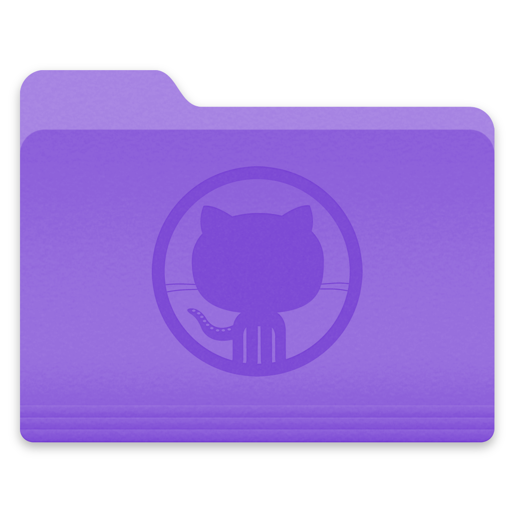
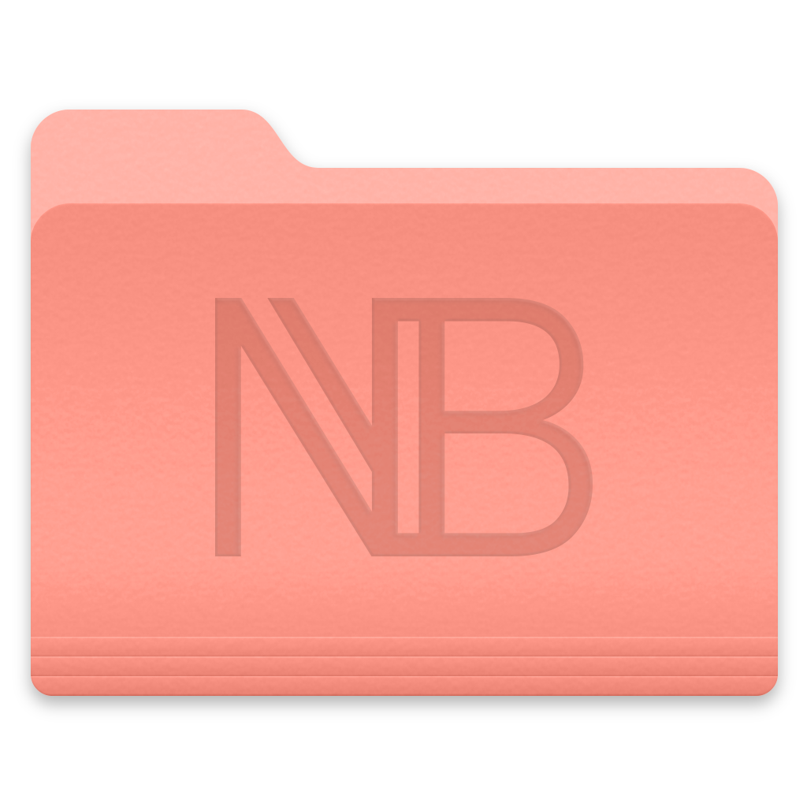

# Extras

This is just a bunch of extra features that I like to have close by. 

## Profile - No Image

These are some profile images that you can use in whatever project you want. I specifically made these at probable sizes that you might find you need. Otherwise, if you need something different then you can use [placehold.it](https://placehold.it) or [LoremPixel](http://lorempixel.com). If you want to download the raw file and make edits, you can get it [here](/no-picture.afdesign).


## Test Document

Use this if you need a test document to test out uploads. For images just use Unsplash or Pixabay.

<a href="/test-document.pdf" target="_blank">test-document.pdf</a>

## Folder Icons

I find it fun to customize some folders so they stand out a little more. On Mac OS Catalina, you can get system icons. Simply go to `Finder > Go > Go to Folder` and paste in the path below.

```
/System/Library/CoreServices/C­oreTypes.bundle/Contents/Resou­rces
```

Copy the file to a temporary location, such as downloads. Open the file, then export it as a `.png` format. Pull it into Photoshop, and do your magic.

### Folder Icons

Download these images and use them as a quick reference


 
