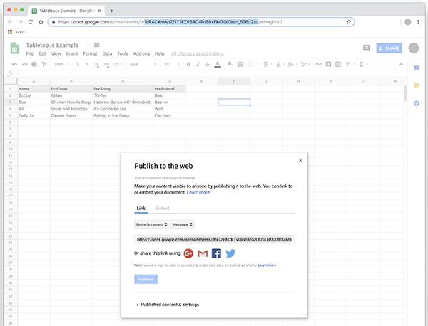

# Tabletop.js

::: tip
  FYI, there is a better version of this. I don't know how stable it is, but it should do simple jobs for free: [GSX2JSON](https://github.com/55sketch/gsx2json), or for a paid version which might be more stable: [SheetDB](https://sheetdb.io)
:::

Below is an example of pulling in content from a Google Spreadsheet. This uses a JavaScript Library called Tabletop.js, which pulls content from the spreadsheet and aranges it into a JavaScript Object. The following are steps to setting up the google spreadsheet:

1. Create a Google Spreadsheet under any account.
2. Type in the first line, which will be the unique key in the JavaScript Object. Enter the rest of the content, which may or may not be unique. **NOTE:** don't use spaces in the first row (object key). It makes coding the page a little more difficult.
3. Select `File > Publish to the Web` and use the default options. You cannot output your content without this step.
4. In your URL, locate the unique 44 (approx.) random characters. You will need this for the JavaScript variable you will set up. **EXAMPLE:** `https://docs.google.com/spreadsheets/d/1cRACXmApZf1Y1FZP3RC-PdE8xFknTQl0inm_5T6c2zo/edit#gid=0`
5. Add the source code provided to the page you wish to add Tabletop to.
6. Replace the random characters in `var public_spreadsheet_url` with your own spreadsheet characters.
7. In function `showInfo(data, tabletop)`, code the data however you wish for it to display.

## Screenshot of Google Sheet



## Code

```html
<!-- THIS EXAMPLE USES BOOTSTRAP 3, FONT AWESOME 4, and jQuery -->
<div class="row">
  <div class="col-sm-12">
    <h1>Tabletop Example</h1>
    <p
      class="text-center loading-spin"
      style="margin-top: 50px; color: #777777;"
    >
      <i class="fa fa-spinner fa-spin fa-3x fa-fw"></i
      ><span class="sr-only">Loading...</span>
    </p>
    <div id="tabletopContent"></div>
  </div>
</div>

<script src="https://cdnjs.cloudflare.com/ajax/libs/tabletop.js/1.5.1/tabletop.min.js"></script>
<script>
  // REPLACE THESE CHARACTERS WITH YOUR OWN SPREADSHEET............... vvvvvvvvvvvvvvvvvvvvvvvvvvvvvvvvvvvvvvvvvvvv ....... //
  var public_spreadsheet_url =
    "https://docs.google.com/spreadsheets/d/1cRACXmApZf1Y1FZP3RC-PdE8xFknTQl0inm_5T6c2zo/pubhtml";

  window.onload = function() {
    init();
  };

  function init() {
    Tabletop.init({
      key: public_spreadsheet_url,
      callback: showInfo,
      simpleSheet: true
    });
  }

  function showInfo(data, tabletop) {
    console.log(data);
    $("p.loading-spin").addClass("hidden");

    // ..................... CODE HERE HOW YOU WANT THE DATA TO DISPLAY ..................... //
    var printObj = JSON.stringify(data);
    $("#tabletopContent").text(printObj);
    // ...................................................................................... //
  }
</script>
```

## Returned JSON Example

The following is an example of the content you would recieve from `printObj;` in the `showInfo()` function.

```
[{"name":"Bobby","favFood":"Italian","favSong":"Thriller","favAnimal":"Bear"},{"name":"Sue","favFood":"Chicken Noodle Soup","favSong":"I Wanna Dance with Somebody","favAnimal":"Beaver"},{"name":"Bill","favFood":"Steak and Potatoes","favSong":"It's Gonna Be Me","favAnimal":"Wolf"},{"name":"Sally Jo","favFood":"Caesar Salad","favSong":"Rolling in the Deep","favAnimal":"Elephant"}]
```

## Vue and Nuxt

If you are using Vue, you can still get the object through the head tag using Vue Meta. It is a slightly unconventional way to write your script, but if you try to write the script in the `mounted()` or `created()` hooks, it may or may not load properly. As of this writing, this is the best way to successfully get the information.

```js
head() {
    return {
      title: 'Tabletop',
      script: [
        {
          hid: 'tabletop',
          src: 'https://cdnjs.cloudflare.com/ajax/libs/tabletop.js/1.5.1/tabletop.min.js',
          callback: () => {
            Tabletop.init({
              key: 'https://docs.google.com/spreadsheets/d/1cRACXmApZf1Y1FZP3RC-PdE8xFknTQl0inm_5T6c2zo/pubhtml',
              simpleSheet: true,
              callback: (data, tabletop) => {
                console.log(data)
                this.favorites = data
                this.loading = false
              }
            })
          }
        }
      ]
    }
  }
```

## Further Documentation

For further information, read the [Tabletop.js Documentation](https://github.com/jsoma/tabletop).
